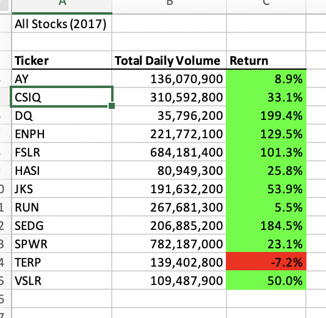
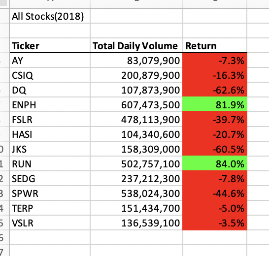

# VBA Challenge Stocks-analysis

## Overview of Project

### The purpose of the project is to analyze some stock data by refactoring VBA solution code to loop through all the data. We have to find the total daily volume and yearly return for each stock for 2017 and 2018.   

## Results: 

### Overall, stocks we analyzed performed better in 2017 than in 2018. In 2017, we can see mostly stocks increased in return:

 ### In 2018, most stocks decreased in return. 

### Refactoring the script improved the run time. 

## Summary 

### -What are the advantages or disadvantages of refactoring code?

### Advantages of refactoring are the following- the code is easier to understand or read, less complex and easier to maintain. Disadvantage of Code Refactoring – can be time consuming.

### -How do these pros and cons apply to refactoring the original VBA script?
### Refactoring the original VBA script will make code easier to understand and a faster execution time, however it might be time consuming. 

